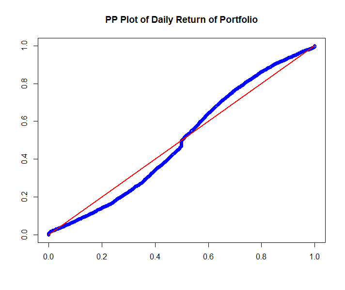
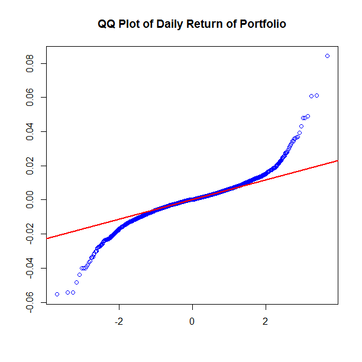

# SFM04Portfolio
[](http://quantlet.de/index.php?p=info)

## [](http://quantlet.de/) **SFM04portfolio** [](http://quantlet.de/d3/ia)

```yaml

Name of QuantLet : SFM04portfolio

Published in : SFM

Description : 'Produces a PP and a QQ Plot of the daily log-returns from 2000-01-03 to 2016-07-07 of a portfolio of Bayer, BMW and Siemens.'

Keywords : 'asset, data visualization, dax, financial, graphical representation, log-returns, plot, portfolio, pp-plot, qq-plot, returns'

See also : 'SFSevt2, SFStailGEV, SFSvar_block_max_backtesting, SFSvar_pot_backtesting'

Author : Xiang Jiang; Fangming ji; Wang Yang; Yuheng Yang

Submitted : Tue, July 19 2016 by quantomas

Datafiles : Portf2000_2016Ret.dat

```






```r
# clear variables and close windows
rm(list = ls(all = TRUE))
graphics.off()

x = read.table("Portf2000_2016Ret.dat ")

n = nrow(x)
xf = apply(x, 2, sort)                          # Sort data in ascending order

t = (1:n)/(n + 1)
dat1 = cbind(pnorm((xf - mean(xf))/sd(xf)), t)  # Determine probabilities
dat2 = cbind(t, t)

# PP Plot
plot(dat1, col = "blue", ylab = (""), xlab = c(""))
lines(dat2, col = "red", lwd = 2.5)
title("PP Plot of Daily Return of Portfolio")

# QQ Plot
dev.new()
qqnorm(xf, col = "blue", xlab = c(""), ylab = c(""), main = ("QQ Plot of Daily Return of Portfolio"))
qqline(xf, col = "red", lwd = 2.5) 
```
